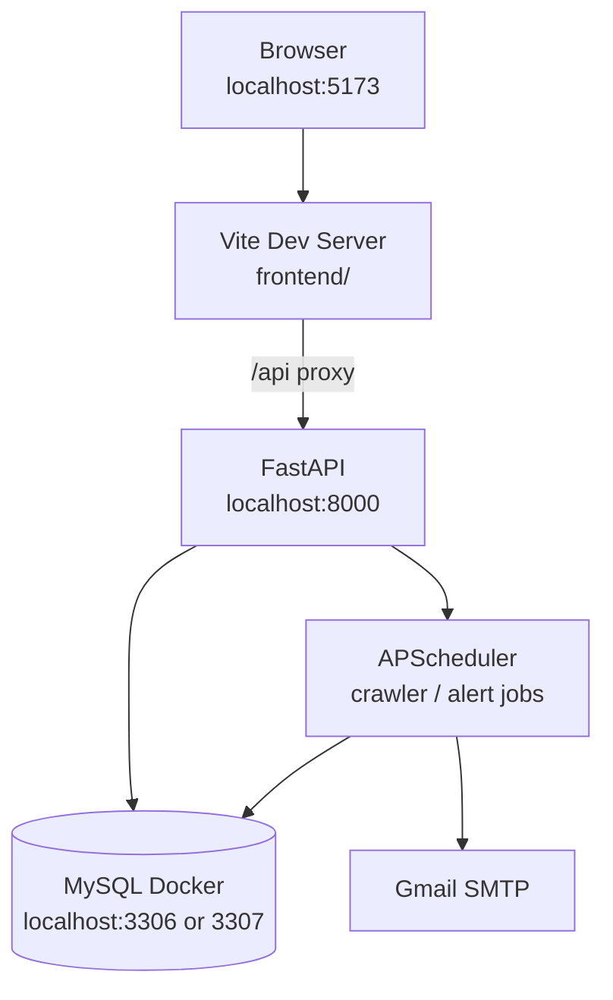
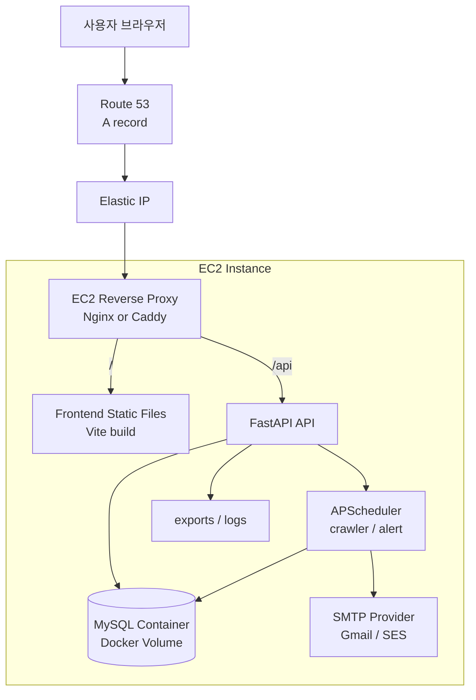
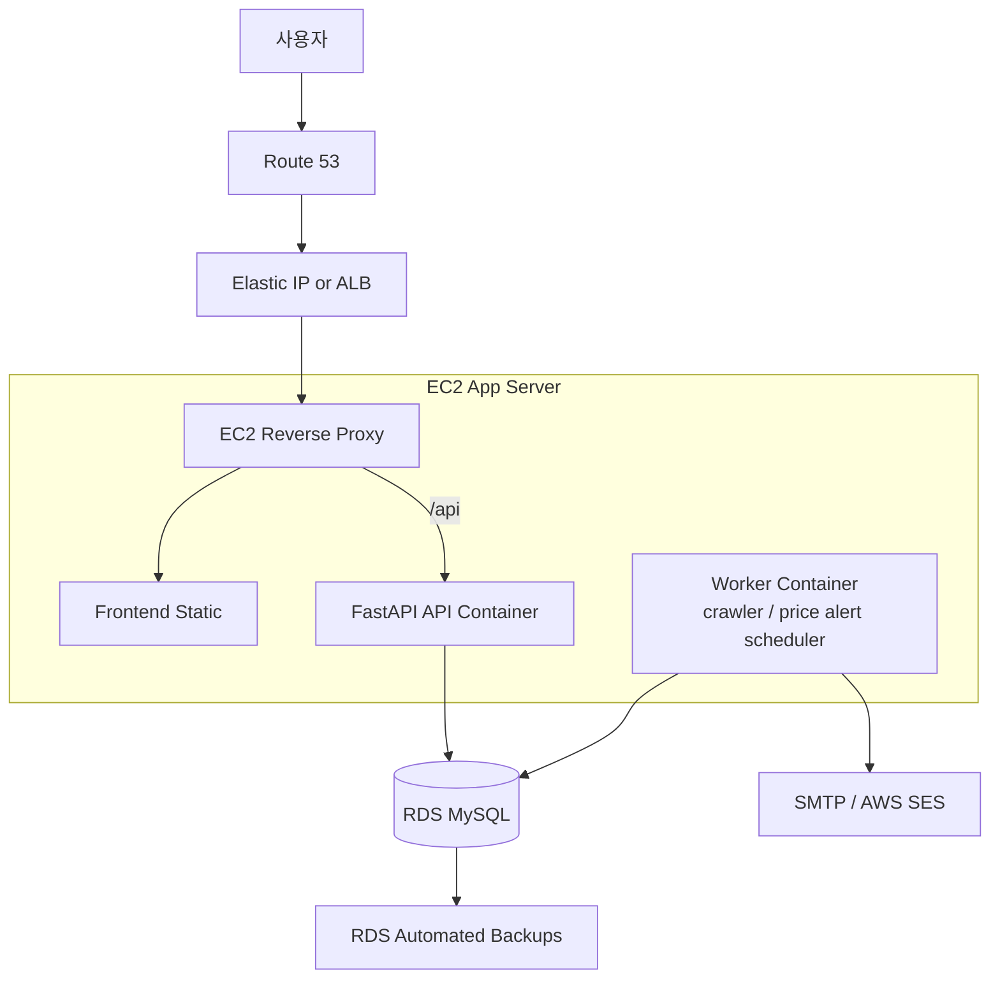
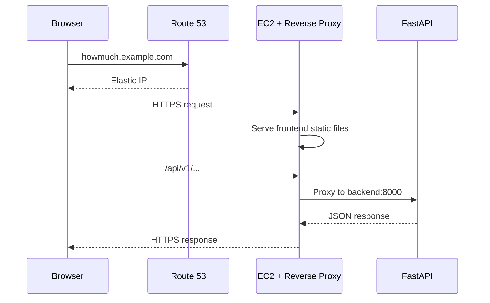
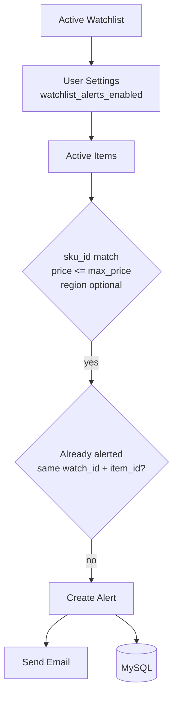

# HowMuch Apple

Apple 중고 매물의 시세를 수집하고, SKU/지역 단위로 가격을 분석하며, 사용자가 저장한 찜 조건에 맞는 매물이 나오면 알림을 보내는 풀스택 애플리케이션입니다.

현재 이 저장소는 백엔드와 프론트엔드를 함께 포함합니다.

```text
AppleHowMuchBackend/
  app/          FastAPI backend, crawler, scheduler, services
  frontend/     React/Vite frontend
  alembic/      MySQL migration
  docs/         crawler/export notes
  exports/      local crawler export outputs
```

## What It Does

- 중고 Apple 매물 크롤링: 당근, 번개장터, 중고나라
- SKU 매핑: 예: `iPhone 17 Pro 256GB`
- 지역 매핑: 시군구/읍면동/행정동 코드 기반 분석
- 시세 분석: 평균가, 최저가, 최고가, 매물 수, 가격 추이
- 찜/가격 알림: 사용자가 저장한 조건 이하 매물이 잡히면 알림 생성 및 이메일 발송
- 관리자/운영 API: 크롤러 상태, 통계, 사용자/알림 관리 기반

## Tech Stack

| Layer | Stack |
|---|---|
| Frontend | React, Vite, Tailwind CSS |
| Backend | FastAPI, SQLAlchemy Async, Alembic |
| Database | MySQL 8.4 |
| Crawling | Python crawler services, Playwright-ready environment |
| Scheduler | APScheduler |
| Auth | Cookie-based JWT, refresh token |
| Email | SMTP, Gmail app password supported |
| Deployment Target | AWS EC2, Docker Compose, reverse proxy |

## Core Data Flow


크롤링된 매물은 `platform + external_id` 조합으로 upsert됩니다. DB 적재 이후 `item`, `sku`, `category`, `emd`, `watchlist`, `alert`를 기준으로 프론트 화면과 알림 기능이 동작합니다.

## Local Architecture



개발 환경에서는 Vite가 `/api` 요청을 `localhost:8000`으로 프록시합니다. 백엔드 프로세스가 시작될 때 APScheduler도 함께 시작됩니다.

## Production Architecture: EC2 MVP

초기 배포는 EC2 1대에 Docker Compose로 올리는 구성이 가장 단순합니다.



이 방식의 장점은 빠른 배포와 낮은 운영 복잡도입니다. 단점은 DB 백업, 장애 복구, 스케일아웃이 EC2 한 대에 묶인다는 점입니다.

### EC2 MVP Container Shape

```text
reverse-proxy
  - 80/443 공개
  - frontend 정적 파일 서빙
  - /api -> backend:8000 프록시

backend
  - FastAPI
  - 내부 포트 8000
  - 외부 공개 금지

mysql
  - MySQL 8.4
  - Docker volume 사용
  - 외부 공개 금지
```

현재 `docker-compose.yml`은 로컬 MySQL 컨테이너만 정의합니다. 운영 배포 전에는 `backend`, `reverse-proxy`, `frontend build`까지 포함하는 production compose를 추가하는 것이 좋습니다.

## Production Architecture: Recommended

운영 안정성을 생각하면 DB는 RDS로 분리하는 것이 좋습니다.



권장 포인트:

- API와 스케줄러/크롤러를 분리합니다.
- API 서버를 여러 개 띄워도 크롤링/알림이 중복 실행되지 않게 합니다.
- MySQL은 RDS로 옮겨 자동 백업과 복구 지점을 확보합니다.
- 이메일은 개발 단계에서는 Gmail SMTP, 운영 단계에서는 AWS SES 같은 발송 서비스를 고려합니다.

현재 코드는 FastAPI lifespan에서 scheduler를 시작합니다. 따라서 API 컨테이너를 여러 개 띄우면 크롤링과 알림 작업이 중복 실행될 수 있습니다. 운영에서 수평 확장하려면 `api` 프로세스와 `worker` 프로세스를 분리하는 변경이 필요합니다.

## AWS Network Plan

### MVP Security Group

| Target | Inbound |
|---|---|
| EC2 | `22` from admin IP only |
| EC2 | `80`, `443` from `0.0.0.0/0` |
| Backend `8000` | Public open 금지, reverse proxy 내부 접근만 |
| MySQL `3306` | Public open 금지 |

### RDS 분리 시

| Target | Inbound |
|---|---|
| EC2 | `22`, `80`, `443` |
| RDS MySQL | `3306` from EC2 security group only |

## Domain And HTTPS

MVP에서는 아래 흐름이 단순합니다.



대표 선택지는 아래와 같습니다.

| Option | Notes |
|---|---|
| Caddy | EC2 단일 배포에서 HTTPS 자동 발급/갱신이 편합니다. |
| Nginx + Certbot | 익숙한 방식이고 제어가 세밀합니다. |
| ALB + ACM | 운영형 구조에 적합합니다. 인증서 관리는 편하지만 비용과 구성이 늘어납니다. |

## Local Setup

### 1. Backend

```bash
cd AppleHowMuchBackend
python -m venv .venv
source .venv/bin/activate
pip install -r requirements.txt
cp .env.example .env
```

`.env`에서 DB와 JWT secret을 로컬 환경에 맞게 수정합니다.

```env
MYSQL_HOST=127.0.0.1
MYSQL_PORT=3306
MYSQL_DB=howmuch
MYSQL_USER=howmuch
MYSQL_PASSWORD=howmuch
SECRET_KEY=change-me
FRONTEND_URL=http://localhost:5173
```

로컬에서 `3306` 포트가 이미 사용 중이면 `docker-compose.yml`의 포트와 `.env`의 `MYSQL_PORT`를 같은 값으로 바꿉니다.

```bash
make mysql-up
alembic upgrade head
uvicorn app.main:app --reload --host 0.0.0.0 --port 8000
```

API 문서:

```text
http://localhost:8000/docs
```

### 2. Frontend

```bash
cd frontend
npm install
npm run dev -- --host 0.0.0.0 --port 5173
```

프론트 개발 서버:

```text
http://localhost:5173
```

### 3. Build Check

```bash
cd frontend
npm run build
```

## Environment Variables

| Key | Purpose |
|---|---|
| `MYSQL_HOST` | MySQL host |
| `MYSQL_PORT` | MySQL port |
| `MYSQL_DB` | Database name |
| `MYSQL_USER` | Database user |
| `MYSQL_PASSWORD` | Database password |
| `SECRET_KEY` | JWT signing secret |
| `COOKIE_DOMAIN` | Production cookie domain |
| `COOKIE_SECURE` | HTTPS 환경에서는 `true` |
| `COOKIE_SAMESITE` | Cookie SameSite policy |
| `SMTP_HOST` | SMTP server |
| `SMTP_PORT` | SMTP port |
| `SMTP_USER` | SMTP login user |
| `SMTP_PASSWORD` | SMTP app password or SMTP secret |
| `FROM_EMAIL` | Sender email |
| `FROM_NAME` | Sender display name |
| `FRONTEND_URL` | CORS allow origin and reset link base |
| `CRAWLER_SCHEDULE` | Cron expression for crawler |
| `ALERT_SCHEDULE` | Cron expression for price alert check |

`.env`는 절대 커밋하지 않습니다.

## API Surface

Base path:

```text
/api/v1
```

주요 라우터:

| Area | Path |
|---|---|
| Auth | `/auth` |
| Users | `/users` |
| Verification | `/verifications` |
| Category | `/categories` |
| Region | `/regions` |
| SKU | `/sku` |
| Analytics | `/analytics` |
| Items | `/items` |
| Watchlist | `/watchlist` |
| Alerts | `/alerts` |
| Search | `/search` |
| Stats | `/stats` |
| Admin | `/admin` |
| System | `/system` |

## Alert Flow



알림 중복은 `watch_id + item_id` 기준으로 방지합니다. 사용자가 같은 조건을 유지하는 동안 같은 매물에 대해 반복 메일을 보내지 않습니다.

## Crawler And Export Notes

크롤러는 플랫폼별 데이터를 공통 형태로 정규화합니다.

공통 핵심 필드:

```text
title
price
url
external_id
source
region_name
dong_code
sku_id
category_id
target_category
target_model
search_keyword
```

검증용 CSV/XLSX 컬럼 설명은 [docs/crawler_export_columns.md](docs/crawler_export_columns.md)를 참고합니다.

## Database

ERD 시각화 파일:

```text
erd.html
```

마이그레이션:

```bash
alembic upgrade head
```

현재 주요 테이블:

| Table | Purpose |
|---|---|
| `users` | 사용자 |
| `verification` | 이메일/전화 인증 코드 |
| `category` | 제품 카테고리 |
| `sku` | 스펙 조합 |
| `item` | 플랫폼 매물 |
| `sd`, `sgg`, `emd` | 지역 계층 |
| `watchlist` | 찜/가격 조건 |
| `alert` | 조건 만족 알림 |
| `crawler_log` | 크롤링 실행 로그 |
| `price_stats` | 집계 가격 통계 |

## EC2 Deployment Runbook

초기 EC2 배포 순서:

1. EC2 생성
2. Elastic IP 연결
3. 보안 그룹 설정: `22`, `80`, `443`만 공개
4. Docker, Docker Compose 설치
5. 저장소 clone
6. `.env` 작성
7. frontend build
8. backend migration
9. docker compose up
10. reverse proxy 설정
11. Route 53 A record를 Elastic IP로 연결
12. HTTPS 인증서 발급
13. `/api/v1/health` 확인

헬스체크:

```bash
curl https://your-domain.com/api/v1/health
```

## Production Checklist

- `DEBUG=false`
- `SECRET_KEY` 긴 랜덤 값 사용
- `COOKIE_SECURE=true`
- `COOKIE_DOMAIN` 운영 도메인으로 설정
- `.env` 서버 내에서만 관리
- MySQL 외부 공개 금지
- `exports/`, DB volume 백업 정책 수립
- SMTP 발송 계정 분리
- 크롤러 과호출 방지
- API와 worker 중복 실행 여부 점검
- 로그 로테이션 설정
- 장애 시 복구 절차 문서화

## Backup Strategy

EC2 내부 MySQL을 쓰는 경우:

```bash
mysqldump -h 127.0.0.1 -P 3306 -u howmuch -p howmuch > backup.sql
```

운영에서는 RDS MySQL을 권장합니다. RDS는 자동 백업과 시점 복구 구성이 가능해서 EC2 volume만 쓰는 것보다 복구 계획이 명확합니다.

## Useful Links

- AWS EC2 Elastic IP: https://docs.aws.amazon.com/AWSEC2/latest/UserGuide/elastic-ip-addresses-eip.html
- Route 53 to EC2 routing: https://docs.aws.amazon.com/Route53/latest/DeveloperGuide/routing-to-ec2-instance.html
- RDS automated backups: https://docs.aws.amazon.com/AmazonRDS/latest/UserGuide/USER_WorkingWithAutomatedBackups.html
- ALB HTTPS listener: https://docs.aws.amazon.com/elasticloadbalancing/latest/application/create-https-listener.html
