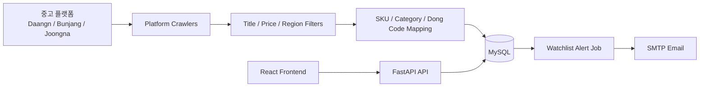
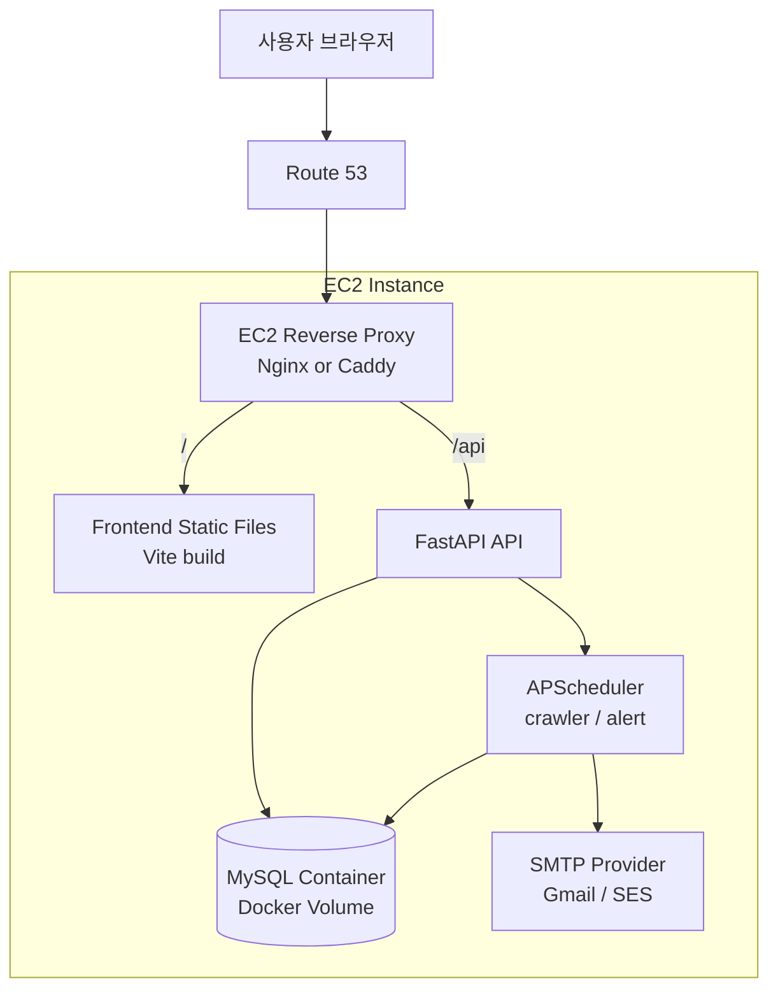
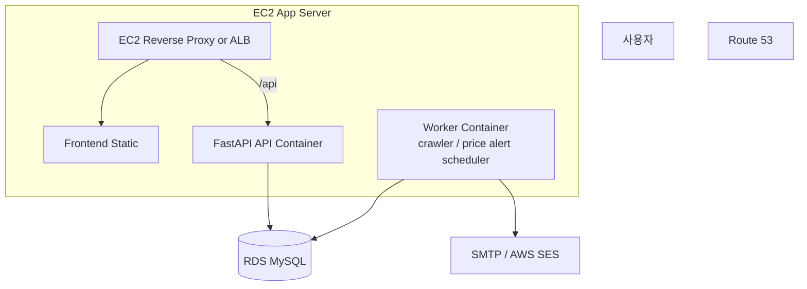
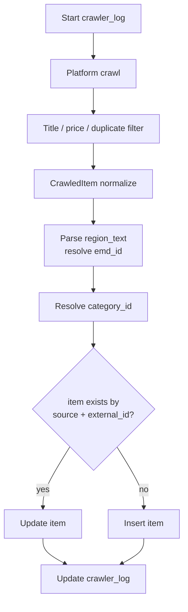

# HowMuch Apple

Apple 중고 매물의 시세를 수집하고, SKU/지역 단위로 가격을 분석하며, 사용자가 저장한 찜 조건에 맞는 매물이 나오면 알림을 보내는 풀스택 애플리케이션입니다.

현재 이 저장소는 백엔드와 프론트엔드를 함께 포함합니다.

```text
AppleHowMuchBackend/
  app/          FastAPI backend, crawler, scheduler, services
  frontend/     React/Vite frontend
  alembic/      MySQL migration
  docs/         crawler/export notes
  exports/      local crawler export outputs
```

## What It Does

- 중고 Apple 매물 크롤링: 당근, 번개장터, 중고나라
- SKU 매핑: 예: `iPhone 17 Pro 256GB`
- 지역 매핑: 시군구/읍면동/행정동 코드 기반 분석
- 시세 분석: 평균가, 최저가, 최고가, 매물 수, 가격 추이
- 찜/가격 알림: 사용자가 저장한 조건 이하 매물이 잡히면 알림 생성 및 이메일 발송
- 관리자/운영 API: 크롤러 상태, 통계, 사용자/알림 관리 기반

## Tech Stack

| Layer | Stack |
|---|---|
| Frontend | React, Vite, Tailwind CSS |
| Backend | FastAPI, SQLAlchemy Async, Alembic |
| Database | MySQL 8.4 |
| Crawling | Playwright, httpx, platform-specific parsers |
| Scheduler | APScheduler |
| Auth | Cookie-based JWT, refresh token |
| Email | SMTP, Gmail app password supported |
| Deployment Target | AWS EC2, Docker Compose, reverse proxy |

## Core Data Flow



크롤링된 매물은 `platform + external_id` 조합으로 upsert됩니다. DB 적재 이후 `item`, `sku`, `category`, `emd`, `watchlist`, `alert`를 기준으로 프론트 화면과 알림 기능이 동작합니다.

## Production Architecture

초기 배포는 EC2 1대에 Docker Compose로 올리는 구성이 가장 단순합니다.



운영 안정성을 높일 때는 DB를 RDS로 분리하고, API와 worker를 분리하는 구조가 좋습니다.



현재 코드는 FastAPI lifespan에서 scheduler를 시작합니다. 따라서 API 컨테이너를 여러 개 띄우면 크롤링과 알림 작업이 중복 실행될 수 있습니다. 운영에서 수평 확장하려면 `api` 프로세스와 `worker` 프로세스를 분리하는 변경이 필요합니다.

## Local Setup

### 1. Backend

```bash
cd AppleHowMuchBackend
python -m venv .venv
source .venv/bin/activate
pip install -r requirements.txt
```

`.env`는 로컬에서 직접 생성하고 DB와 JWT secret을 환경에 맞게 수정합니다.

```env
MYSQL_HOST=127.0.0.1
MYSQL_PORT=3306
MYSQL_DB=howmuch
MYSQL_USER=howmuch
MYSQL_PASSWORD=howmuch
SECRET_KEY=change-me
FRONTEND_URL=http://localhost:5173
```

로컬에서 `3306` 포트가 이미 사용 중이면 `docker-compose.yml`의 포트와 `.env`의 `MYSQL_PORT`를 같은 값으로 바꿉니다.

```bash
make mysql-up
alembic upgrade head
uvicorn app.main:app --reload --host 0.0.0.0 --port 8000
```

API 문서:

```text
http://localhost:8000/docs
```

### 2. Frontend

```bash
cd frontend
npm install
npm run dev -- --host 0.0.0.0 --port 5173
```

프론트 개발 서버:

```text
http://localhost:5173
```

### 3. Build Check

```bash
cd frontend
npm run build
```

## Environment Variables

| Key | Purpose |
|---|---|
| `MYSQL_HOST` | MySQL host |
| `MYSQL_PORT` | MySQL port |
| `MYSQL_DB` | Database name |
| `MYSQL_USER` | Database user |
| `MYSQL_PASSWORD` | Database password |
| `SECRET_KEY` | JWT signing secret |
| `COOKIE_DOMAIN` | Production cookie domain |
| `COOKIE_SECURE` | HTTPS 환경에서는 `true` |
| `COOKIE_SAMESITE` | Cookie SameSite policy |
| `SMTP_HOST` | SMTP server |
| `SMTP_PORT` | SMTP port |
| `SMTP_USER` | SMTP login user |
| `SMTP_PASSWORD` | SMTP app password or SMTP secret |
| `FROM_EMAIL` | Sender email |
| `FROM_NAME` | Sender display name |
| `FRONTEND_URL` | CORS allow origin and reset link base |
| `CRAWLER_SCHEDULE` | Cron expression for crawler |
| `ALERT_SCHEDULE` | Cron expression for price alert check |

`.env`는 절대 커밋하지 않습니다.

## Crawling

크롤러는 `app/crawlers` 아래에 플랫폼별로 나뉘어 있습니다.

| Platform | File | Method |
|---|---|---|
| Daangn | `app/crawlers/daangn.py` | Playwright로 검색 페이지 렌더링 후 DOM에서 매물 링크/텍스트 추출, 상세 HTML에서 지역 보강 |
| Bunjang | `app/crawlers/bunjang.py` | 공개 JSON API 조회 후 필요 시 상세 API로 지역 보강 |
| Joongna | `app/crawlers/joongna.py` | Playwright 렌더링 수집 + HTML 검색 페이지 fallback, 상세 HTML에서 `locationName`, `dongCode` 추출 |

### Crawl Targets

검색 대상은 `app/crawlers/targets.py`의 `CRAWL_TARGETS`가 기준입니다. 각 target은 아래 값을 가집니다.

```text
category
model
released_year
primary_keyword
aliases
```

예를 들어 `iPhone 17 Pro`는 `아이폰 17 프로`, `아이폰17프로`, `iPhone 17 Pro` 같은 키워드로 검색됩니다. iPhone, iPad, MacBook, Apple Watch, AirPods의 2022년 이후 모델들이 target에 들어 있습니다.

### Common Pipeline

모든 플랫폼 크롤러는 `BaseCrawler.run()`을 통해 같은 저장 흐름을 탑니다.



공통 저장 필드:

```text
title
price
url
external_id
source
region_name
dong_code
sku_id
category_id
target_category
target_model
search_keyword
```

중복 저장은 `item.source == platform` 그리고 `item.external_id == external_id` 기준으로 방지합니다. 기존 매물이 있으면 가격, 제목, 상태, URL, 지역, 검색 키워드를 업데이트하고, 새 매물이면 `item`에 insert합니다.

### Daangn Crawler

당근 크롤러는 Playwright Chromium을 headless로 띄워 검색 페이지를 렌더링합니다.

주요 흐름:

1. `https://www.daangn.com/kr/buy-sell/?search={keyword}` 접속
2. DOM에서 `/kr/buy-sell/` 링크를 가진 anchor 추출
3. 링크 텍스트에서 제목, 가격, 목록 지역 파싱
4. `더보기`/`더 불러오기` 버튼 클릭과 스크롤 반복
5. 상세 페이지 HTML을 httpx로 조회해 더 정확한 지역 텍스트 추출
6. `matches_target_title()`로 액세서리/구매글/다른 모델 제거

현재 코드에 있는 요청 조절:

- `MAX_SCROLL_ROUNDS = 25`
- 렌더링 후 초기 대기 `5초`
- 스크롤 settling `1.2초`
- 키워드 처리 후 `0.8초`
- target 처리 후 `1.5초`
- 상세 지역 조회 동시성 `Semaphore(8)`
- 일반 브라우저 형태의 `User-Agent` 설정

차단 감지/대응:

- HTTP 상세 조회는 `raise_for_status()`로 실패를 감지하고 debug log를 남깁니다.
- 검색 페이지 렌더링 실패는 warning log로 남기고 다음 키워드로 넘어갑니다.
- 명시적인 403/429 전용 backoff, 프록시 회전, CAPTCHA 처리, stealth fingerprint 우회 코드는 없습니다.

### Bunjang Crawler

번개장터 크롤러는 브라우저 렌더링 없이 JSON API를 직접 조회합니다.

주요 흐름:

1. `https://api.bunjang.co.kr/api/1/find_v2.json` 호출
2. query parameter로 `q`, `order=date`, `page`, `n=100`, 서울 좌표 값을 전달
3. 응답 `list`에서 `pid`, `name`, `price`, `location` 추출
4. 지역이 비어 있으면 `https://api.bunjang.co.kr/api/pms/v1/products/{pid}/detail/web` 상세 API 호출
5. 상세 응답의 `geo.address` 또는 `직거래 희망 장소`를 지역으로 사용
6. `matches_target_title()`로 target 모델에 맞는 매물만 저장

현재 코드에 있는 요청 조절:

- `BUNJANG_PAGE_SIZE = 100`
- `MAX_BUNJANG_PAGES = 20`
- 페이지 처리 간 `0.35초`
- target 처리 후 `1초`
- 상세 지역 조회 동시성 `Semaphore(8)`
- `User-Agent`, `Referer` 헤더 설정
- 새 매물이 없는 페이지가 3번 이어지면 해당 키워드 중단

차단 감지/대응:

- API 응답은 `raise_for_status()`로 HTTP 오류를 감지합니다.
- 실패하면 warning/debug log를 남기고 다음 키워드 또는 다음 처리로 넘어갑니다.
- 별도의 403/429 전용 backoff, 프록시 회전, 세션 쿠키 재사용, CAPTCHA 우회 코드는 없습니다.

### Joongna Crawler

중고나라 크롤러는 Playwright 기반 렌더링 수집과 HTML fallback을 함께 사용합니다.

주요 흐름:

1. `https://web.joongna.com/search/{keyword}` 접속
2. DOM에서 `/product/{id}` 링크를 가진 anchor 추출
3. 제목/가격 파싱 후 target title filter 적용
4. Playwright 결과가 부족하면 httpx로 검색 HTML 페이지를 직접 조회하는 fallback 실행
5. 상세 페이지 `https://web.joongna.com/product/{external_id}` 조회
6. 상세 HTML에서 escaped JSON 형태의 `locationName`, `dongCode`를 정규식으로 추출
7. `dongCode`의 시군구 prefix와 `locationName`을 조합해 지역 텍스트를 보강

현재 코드에 있는 요청 조절:

- `MAX_SCROLL_ROUNDS = 25`
- `MAX_HTML_PAGES = 10`
- 렌더링 후 초기 대기 `5초`
- 스크롤 settling `1.2초`
- 키워드 처리 후 `0.8초`
- target 처리 후 `2초`
- HTML fallback 페이지 간 `0.25초`
- 상세 지역 조회 동시성 `Semaphore(8)`
- 일반 브라우저 형태의 `User-Agent`, `Accept` 헤더 설정

차단 감지/대응:

- Playwright 렌더링 실패는 warning log로 남깁니다.
- HTML fallback과 상세 HTML 조회는 `raise_for_status()`로 HTTP 오류를 감지합니다.
- 새 매물이 없는 HTML 페이지가 2번 이어지면 fallback을 중단합니다.
- 프록시 회전, CAPTCHA 처리, stealth fingerprint 우회, 로그인 세션 우회 코드는 없습니다.

### Title Filtering

`app/crawlers/filters.py`는 수집 품질을 높이기 위한 제목 필터입니다.

- 케이스, 필름, 충전기, 박스만, 부품용 같은 액세서리/부품 매물 제외
- 구매합니다, 삽니다, 교환합니다 같은 구매/교환 글 제외
- iPhone Pro/Pro Max/Plus 구분
- iPad Air/Pro/mini, MacBook Air/Pro, Apple Watch Series/SE/Ultra 구분
- AirPods 한쪽/유닛/본체만 같은 부분품 제외

### Export

검증용 CSV/XLSX 컬럼 설명은 [docs/crawler_export_columns.md](docs/crawler_export_columns.md)를 참고합니다. 최신 DB 결과를 플랫폼별로 제한해서 Excel로 export하는 코드는 `app/crawlers/export_excel.py`에 있습니다.

## Database

ERD 시각화 파일:

```text
erd.html
```

마이그레이션:

```bash
alembic upgrade head
```

현재 스키마는 SQLAlchemy model metadata를 Alembic에서 생성합니다. 주요 테이블은 아래와 같습니다.

### Region Tables

| Table | Columns | Purpose |
|---|---|---|
| `sd` | `sd_id`, `name` | 시/도. 예: 서울특별시 |
| `sgg` | `sgg_id`, `sd_id`, `name` | 시군구. `sd` 하위 계층 |
| `emd` | `emd_id`, `dong_code`, `sgg_id`, `name` | 읍면동/행정동. `dong_code`는 행정동 코드 매핑에 사용 |

### Product Catalog Tables

| Table | Columns | Purpose |
|---|---|---|
| `category` | `category_id`, `name` | iPhone, iPad, MacBook 같은 제품군 |
| `attribute` | `attribute_id`, `code`, `label`, `datatype`, `unit`, `description` | 용량, 모델, 색상 등 속성 정의 |
| `attribute_option` | `option_id`, `attribute_id`, `value`, `sort_order` | 속성의 선택지. 예: 256GB, 512GB |
| `category_attribute` | `category_id`, `attribute_id`, `is_required`, `display_group`, `sort_order` | 카테고리별 필수/표시 속성 연결 |
| `sku` | `sku_id`, `category_id`, `fingerprint`, `search_count` | 특정 제품 스펙 조합. 예: iPhone 17 Pro 256GB |
| `sku_attribute` | `sku_id`, `attribute_id`, `option_id`, `value_text`, `value_int`, `value_decimal`, `value_bool` | SKU가 가진 속성 값 |

### Listing And Price Tables

| Table | Columns | Purpose |
|---|---|---|
| `item` | `item_id`, `sku_id`, `emd_id`, `category_id`, `region_text`, `region_sgg`, `region_emd`, `dong_code`, `search_keyword`, `title`, `price`, `status`, `url`, `source`, `external_id`, `created_at`, `updated_at` | 플랫폼에서 수집한 개별 매물. `source + external_id`가 upsert 기준 |
| `item_attribute_value` | `item_id`, `attribute_id`, `option_id`, `value_text`, `value_int`, `value_decimal`, `value_bool` | 매물 단위의 속성 값 확장용 |
| `price_stats` | `sku_id`, `emd_id`, `bucket_ts`, `items_num`, `sum_price`, `avg_price`, `min_price`, `max_price` | SKU/지역/시간 bucket 기준 집계 가격 통계 |

### User And Auth Tables

| Table | Columns | Purpose |
|---|---|---|
| `users` | `user_id`, `email`, `password_hash`, `nickname`, `phone`, `is_email_verified`, `is_phone_verified`, `alert_email`, `alert_sms`, `dnd_enabled`, `dnd_start`, `dnd_end`, `watchlist_alerts_enabled`, `is_admin`, `status`, `oauth_provider`, `oauth_subject`, `deleted_at`, `created_at`, `updated_at` | 사용자, 알림 설정, OAuth 연결, soft delete 상태 |
| `refresh_token` | `token_id`, `user_id`, `token_hash`, `expires_at`, `revoked_at`, `created_at` | refresh token 저장. 원문이 아니라 hash 저장 |
| `verification` | `verification_id`, `user_id`, `type`, `target`, `code_hash`, `expires_at`, `verified_at`, `created_at` | 이메일/전화/비밀번호 재설정 인증 코드 hash와 만료 시간 |

### Watchlist And Alert Tables

| Table | Columns | Purpose |
|---|---|---|
| `watchlist` | `watch_id`, `user_id`, `sku_id`, `emd_id`, `max_price`, `label`, `alert_email`, `alert_sms`, `is_active`, `created_at`, `updated_at` | 사용자가 저장한 찜/가격 조건 |
| `alert` | `alert_id`, `user_id`, `watch_id`, `item_id`, `message`, `is_read`, `sent_email`, `sent_sms`, `triggered_at` | 조건을 만족한 매물 알림. 같은 `watch_id + item_id`는 중복 생성하지 않음 |

### Crawler Tables

| Table | Columns | Purpose |
|---|---|---|
| `crawler_log` | `log_id`, `platform`, `status`, `items_upserted`, `duration_sec`, `error`, `started_at`, `finished_at`, `created_at` | 플랫폼별 크롤러 실행 기록과 실패 원인 |
