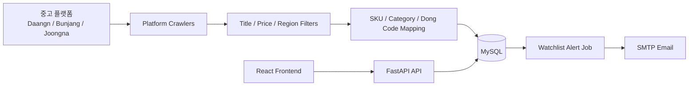
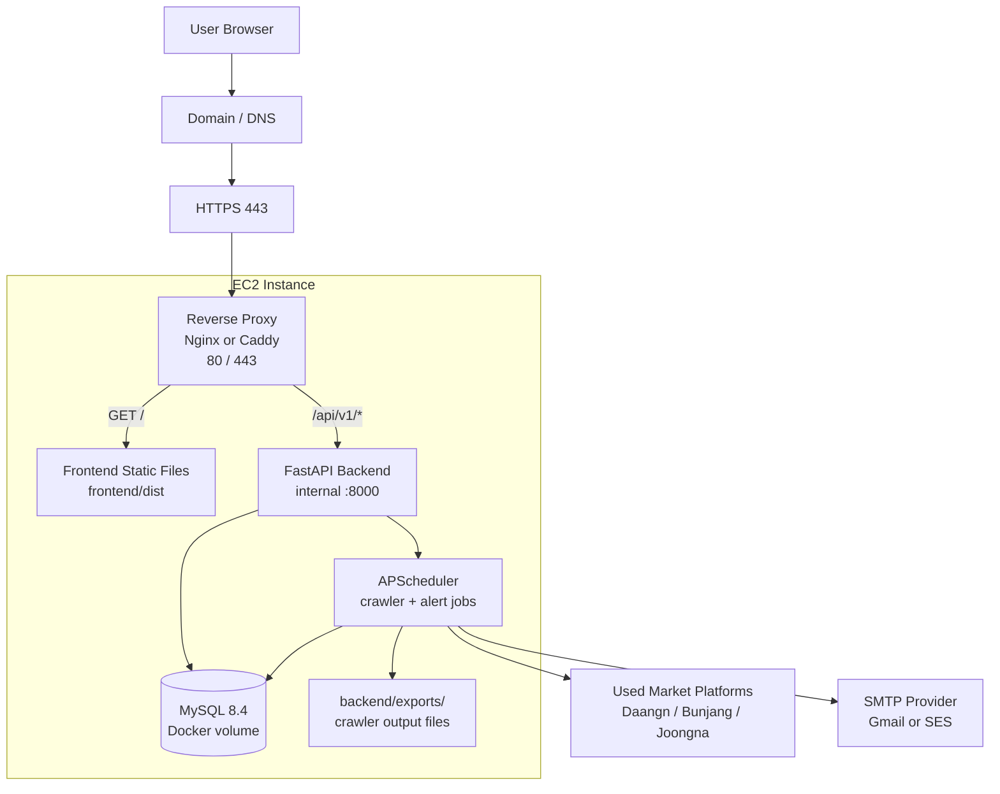
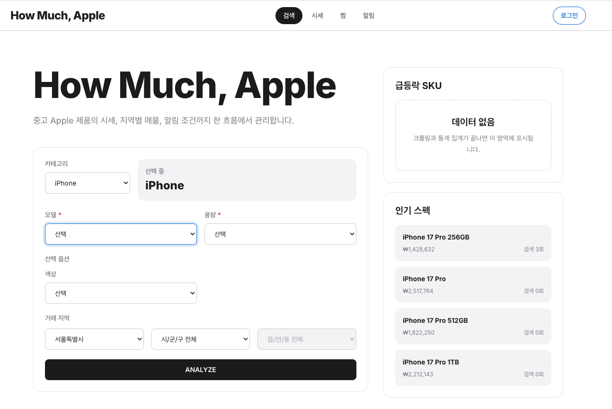
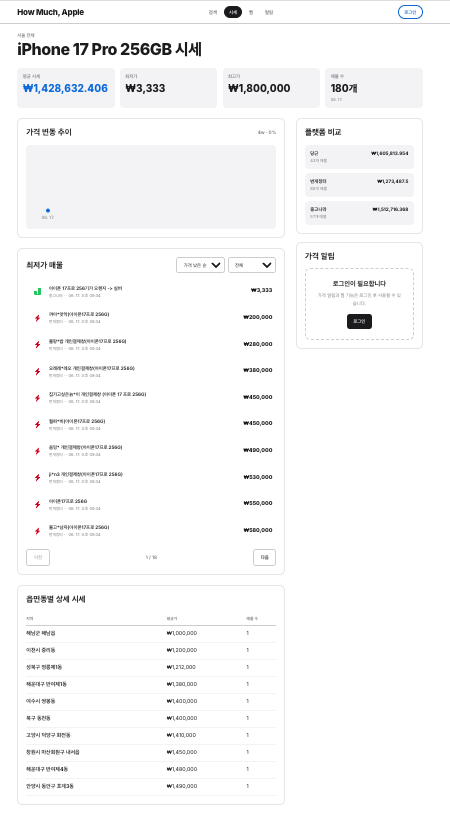
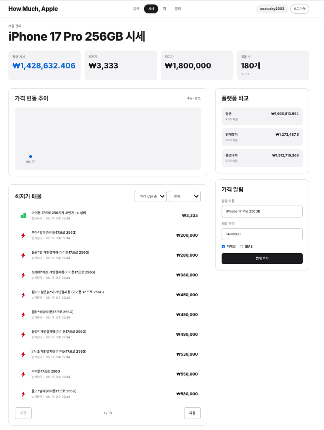
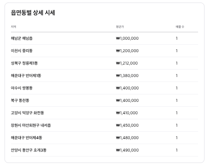
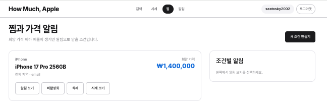
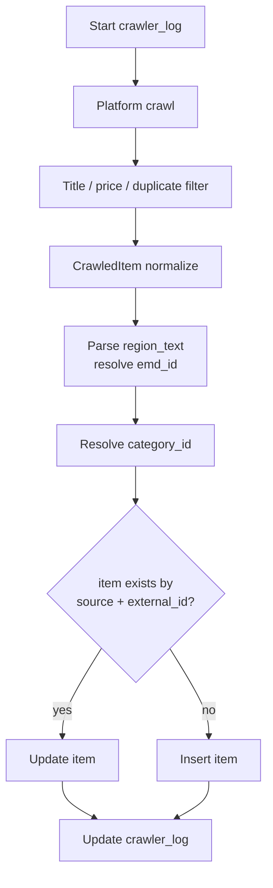

# HowMuch Apple

Apple 중고 매물의 시세를 수집하고, SKU/지역 단위로 가격을 분석하며, 사용자가 저장한 찜 조건에 맞는 매물이 나오면 알림을 보내는 풀스택 애플리케이션입니다.

이 저장소는 frontend와 backend를 함께 관리하는 monorepo입니다.

```text
HowMuchApple/
  README.md
  docker-compose.yml
  docs/
  deploy/

  backend/
    app/
    alembic/
    requirements.txt
    alembic.ini
    Makefile
    exports/

  frontend/
    src/
    public/
    package.json
    vite.config.js
```

## What It Does

- 중고 Apple 매물 크롤링: 당근, 번개장터, 중고나라
- SKU 매핑: 예: `iPhone 17 Pro 256GB`
- 지역 매핑: 시군구/읍면동/행정동 코드 기반 분석
- 시세 분석: 평균가, 최저가, 최고가, 매물 수, 가격 추이
- 찜/가격 알림: 사용자가 저장한 조건 이하 매물이 잡히면 알림 생성 및 이메일 발송
- 관리자/운영 API: 크롤러 상태, 통계, 사용자/알림 관리 기반

## Tech Stack

| Layer | Stack |
|---|---|
| Frontend | React, Vite, Tailwind CSS |
| Backend | FastAPI, SQLAlchemy Async, Alembic |
| Database | MySQL 8.4 |
| Crawling | Playwright, httpx, platform-specific parsers |
| Scheduler | APScheduler |
| Auth | Cookie-based JWT, refresh token |
| Email | SMTP, Gmail app password supported |
| Deployment Target | AWS EC2, Docker Compose, reverse proxy |

## Core Data Flow



크롤링된 매물은 `platform + external_id` 조합으로 upsert됩니다. DB 적재 이후 `item`, `sku`, `category`, `emd`, `watchlist`, `alert`를 기준으로 프론트 화면과 알림 기능이 동작합니다.

## Production Architecture

배포 환경은 EC2 1대에서 reverse proxy, frontend 정적 파일, FastAPI backend, MySQL을 함께 운영하는 구조를 기준으로 합니다. 외부에는 `80/443`만 열고, backend와 MySQL은 EC2 내부에서만 접근합니다.



현재 코드에서는 FastAPI 프로세스가 API 요청 처리와 APScheduler 작업을 함께 수행합니다. 크롤링과 가격 알림 작업은 backend 프로세스 내부에서 실행되고, 결과는 MySQL과 `backend/exports/`에 저장됩니다.

## Screenshots

### Search And SKU Selection



### Market Summary



### Price Alert Creation



### Regional Breakdown



### Watchlist



## Local Setup

### 1. Backend

```bash
cd backend
python -m venv .venv
source .venv/bin/activate
pip install -r requirements.txt
```

`backend/.env`는 로컬에서 직접 생성하고 DB와 JWT secret을 환경에 맞게 수정합니다.

```env
MYSQL_HOST=127.0.0.1
MYSQL_PORT=3306
MYSQL_DB=howmuch
MYSQL_USER=howmuch
MYSQL_PASSWORD=howmuch
SECRET_KEY=change-me
FRONTEND_URL=http://localhost:5173
```

로컬에서 `3306` 포트가 이미 사용 중이면 루트의 `docker-compose.yml` 포트와 `backend/.env`의 `MYSQL_PORT`를 같은 값으로 바꿉니다.

```bash
make mysql-up
python -m alembic upgrade head
python -m uvicorn app.main:app --reload --host 0.0.0.0 --port 8000
```

API 문서:

```text
http://localhost:8000/docs
```

### 2. Frontend

```bash
cd frontend
npm install
npm run dev -- --host 0.0.0.0 --port 5173
```

프론트 개발 서버:

```text
http://localhost:5173
```

### 3. Build Check

```bash
cd frontend
npm run build
```

## Environment Variables

| Key | Purpose |
|---|---|
| `MYSQL_HOST` | MySQL host |
| `MYSQL_PORT` | MySQL port |
| `MYSQL_DB` | Database name |
| `MYSQL_USER` | Database user |
| `MYSQL_PASSWORD` | Database password |
| `SECRET_KEY` | JWT signing secret |
| `COOKIE_DOMAIN` | Production cookie domain |
| `COOKIE_SECURE` | HTTPS 환경에서는 `true` |
| `COOKIE_SAMESITE` | Cookie SameSite policy |
| `SMTP_HOST` | SMTP server |
| `SMTP_PORT` | SMTP port |
| `SMTP_USER` | SMTP login user |
| `SMTP_PASSWORD` | SMTP app password or SMTP secret |
| `FROM_EMAIL` | Sender email |
| `FROM_NAME` | Sender display name |
| `FRONTEND_URL` | CORS allow origin and reset link base |
| `CRAWLER_SCHEDULE` | Cron expression for crawler |
| `ALERT_SCHEDULE` | Cron expression for price alert check |

`.env`는 절대 커밋하지 않습니다.

## Crawling

크롤러는 `backend/app/crawlers` 아래에 플랫폼별로 나뉘어 있습니다.

| Platform | File | Method |
|---|---|---|
| Daangn | `backend/app/crawlers/daangn.py` | Playwright로 검색 페이지 렌더링 후 DOM에서 매물 링크/텍스트 추출 |
| Bunjang | `backend/app/crawlers/bunjang.py` | JSON API 조회 후 필요 시 상세 API로 지역 보강 |
| Joongna | `backend/app/crawlers/joongna.py` | Playwright 렌더링 수집 + HTML 검색 페이지 fallback |

검색 대상은 `backend/app/crawlers/targets.py`의 `CRAWL_TARGETS`가 기준입니다. iPhone, iPad, MacBook, Apple Watch, AirPods의 2022년 이후 모델들이 target에 들어 있습니다.

모든 플랫폼 크롤러는 `BaseCrawler.run()`을 통해 같은 저장 흐름을 탑니다.



공통 저장 필드:

```text
title
price
url
external_id
source
region_name
dong_code
sku_id
category_id
target_category
target_model
search_keyword
```

중복 저장은 `item.source == platform` 그리고 `item.external_id == external_id` 기준으로 방지합니다. 기존 매물이 있으면 가격, 제목, 상태, URL, 지역, 검색 키워드를 업데이트하고, 새 매물이면 `item`에 insert합니다.

## Database

ERD 시각화 파일:

```text
docs/erd.html
```

마이그레이션:

```bash
cd backend
python -m alembic upgrade head
```

현재 스키마는 SQLAlchemy model metadata를 Alembic에서 생성합니다. 주요 테이블은 아래와 같습니다.

### Region Tables

| Table | Columns | Purpose |
|---|---|---|
| `sd` | `sd_id`, `name` | 시/도. 예: 서울특별시 |
| `sgg` | `sgg_id`, `sd_id`, `name` | 시군구. `sd` 하위 계층 |
| `emd` | `emd_id`, `dong_code`, `sgg_id`, `name` | 읍면동/행정동. `dong_code`는 행정동 코드 매핑에 사용 |

### Product Catalog Tables

| Table | Columns | Purpose |
|---|---|---|
| `category` | `category_id`, `name` | iPhone, iPad, MacBook 같은 제품군 |
| `attribute` | `attribute_id`, `code`, `label`, `datatype`, `unit`, `description` | 용량, 모델, 색상 등 속성 정의 |
| `attribute_option` | `option_id`, `attribute_id`, `value`, `sort_order` | 속성의 선택지. 예: 256GB, 512GB |
| `category_attribute` | `category_id`, `attribute_id`, `is_required`, `display_group`, `sort_order` | 카테고리별 필수/표시 속성 연결 |
| `sku` | `sku_id`, `category_id`, `fingerprint`, `search_count` | 특정 제품 스펙 조합. 예: iPhone 17 Pro 256GB |
| `sku_attribute` | `sku_id`, `attribute_id`, `option_id`, `value_text`, `value_int`, `value_decimal`, `value_bool` | SKU가 가진 속성 값 |

### Listing And Price Tables

| Table | Columns | Purpose |
|---|---|---|
| `item` | `item_id`, `sku_id`, `emd_id`, `category_id`, `region_text`, `region_sgg`, `region_emd`, `dong_code`, `search_keyword`, `title`, `price`, `status`, `url`, `source`, `external_id`, `created_at`, `updated_at` | 플랫폼에서 수집한 개별 매물. `source + external_id`가 upsert 기준 |
| `item_attribute_value` | `item_id`, `attribute_id`, `option_id`, `value_text`, `value_int`, `value_decimal`, `value_bool` | 매물 단위의 속성 값 확장용 |
| `price_stats` | `sku_id`, `emd_id`, `bucket_ts`, `items_num`, `sum_price`, `avg_price`, `min_price`, `max_price` | SKU/지역/시간 bucket 기준 집계 가격 통계 |

### User And Auth Tables

| Table | Columns | Purpose |
|---|---|---|
| `users` | `user_id`, `email`, `password_hash`, `nickname`, `phone`, `is_email_verified`, `is_phone_verified`, `alert_email`, `alert_sms`, `dnd_enabled`, `dnd_start`, `dnd_end`, `watchlist_alerts_enabled`, `is_admin`, `status`, `oauth_provider`, `oauth_subject`, `deleted_at`, `created_at`, `updated_at` | 사용자, 알림 설정, OAuth 연결, soft delete 상태 |
| `refresh_token` | `token_id`, `user_id`, `token_hash`, `expires_at`, `revoked_at`, `created_at` | refresh token 저장. 원문이 아니라 hash 저장 |
| `verification` | `verification_id`, `user_id`, `type`, `target`, `code_hash`, `expires_at`, `verified_at`, `created_at` | 이메일/전화/비밀번호 재설정 인증 코드 hash와 만료 시간 |

### Watchlist And Alert Tables

| Table | Columns | Purpose |
|---|---|---|
| `watchlist` | `watch_id`, `user_id`, `sku_id`, `emd_id`, `max_price`, `label`, `alert_email`, `alert_sms`, `is_active`, `created_at`, `updated_at` | 사용자가 저장한 찜/가격 조건 |
| `alert` | `alert_id`, `user_id`, `watch_id`, `item_id`, `message`, `is_read`, `sent_email`, `sent_sms`, `triggered_at` | 조건을 만족한 매물 알림. 같은 `watch_id + item_id`는 중복 생성하지 않음 |

### Crawler Tables

| Table | Columns | Purpose |
|---|---|---|
| `crawler_log` | `log_id`, `platform`, `status`, `items_upserted`, `duration_sec`, `error`, `started_at`, `finished_at`, `created_at` | 플랫폼별 크롤러 실행 기록과 실패 원인 |
